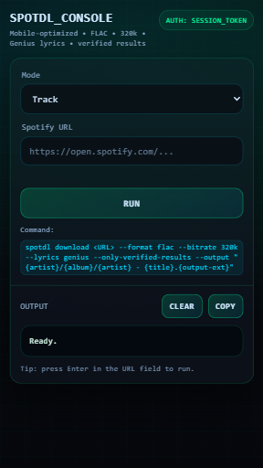

# SpotDL Web Interface

Web-based frontend for [SpotDL](https://github.com/spotDL/spotify-downloader) with Flask backend. Designed for self-hosted deployments on Linux servers and Proxmox LXC containers.

[


## Features

- **Download Modes**: Track, Album (with --fetch-albums), Playlist
- **Audio Format**: FLAC primary, 320k MP3 fallback
- **Organization**: Automatic directory structure by artist/album
- **Metadata**: Genius lyrics integration, verified results only
- **Playlist Support**: Automatic .m3u generation
- **Authentication**: Session-based token access
- **Service**: systemd integration with auto-restart
- **Interface**: Responsive web UI with real-time output

## Quick Start

### Requirements

- Linux system (Debian/Ubuntu)
- Root access
- Network connectivity

### Installation

1. **Download the setup script**:
```bash
wget https://raw.githubusercontent.com/YOUR_USERNAME/YOUR_REPO/main/setup.sh
chmod +x setup.sh
```

2. **Run the installation**:
```bash
./setup.sh
```

The script will:
- Update system packages
- Install Python, FFmpeg, and dependencies
- Configure SpotDL and Flask application
- Create systemd service
- Start the service

3. **Configure authentication**:
```bash
nano /etc/systemd/system/spotdl-web.service
```

Modify:
```
Environment="SPOTDL_TOKEN=your-secret-token-here"
```

Replace with a secure token/password.

4. **Restart the service**:
```bash
systemctl daemon-reload
systemctl restart spotdl-web
```

5. **Access interface**:
```
http://SERVER_IP:5000
```
Authenticate with configured token/password.


**Screenshots**




## Usage

### Download Process

1. Select mode (Track/Albums/Playlist)
2. Input Spotify URL or URI
3. Execute download
4. Monitor output in real-time

### Output Structure

```
/music/
├── Artist Name/
│   └── Album Name/
│       ├── Artist Name - Track 01.flac
│       └── Artist Name - Track 02.flac
└── playlists/
    └── Playlist Name/
        ├── Playlist Name.m3u
        ├── Artist - Track 01.flac
        └── Artist - Track 02.flac
```

## Management

### Service Control
```bash
# Status
systemctl status spotdl-web

# Logs
journalctl -u spotdl-web -f

# Restart
systemctl restart spotdl-web

# Stop
systemctl stop spotdl-web
```

### Update SpotDL
```bash
pip3 install --upgrade spotdl --break-system-packages
systemctl restart spotdl-web
```

## Proxmox LXC Deployment

Container specifications:
- OS: Debian 12 / Ubuntu 22.04
- RAM: 1GB minimum, 2GB recommended
- Storage: 2GB+ (scales with collection, designed to be used with a NFS/SMB mount in /music)
- Network: Bridged mode

Run setup script post-creation.

Optional NFS/CIFS mount:
```bash
# /etc/fstab
//nas.local/music /music cifs credentials=/root/.smbcreds,uid=0,gid=0 0 0
```

## Technical Details

### Audio Quality
- Format: FLAC (lossless), MP3 320k fallback
- Metadata: Genius lyrics, verified results only
- Source: YouTube-Music (via SpotDL)

### Security
- Session-based authentication
- Environment variable token storage
- Invalid request rejection
- Unauthorized access returns 404

### Architecture
- Backend: Flask (Python)
- Process: subprocess spawning for SpotDL
- Service: systemd daemon
- Port: 5000 (default)

## Troubleshooting

### Service Issues
```bash
# Check logs
journalctl -u spotdl-web -n 50

# Verify dependencies
python3 --version
spotdl --version
```

### Network Issues
```bash
# Check service
systemctl status spotdl-web

# Verify port binding
ss -tulpn | grep 5000

# Check firewall
ufw status
```

### Download Failures
```bash
# Update SpotDL
pip3 install --upgrade spotdl --break-system-packages

# Check storage
df -h /music

# Verify FFmpeg
ffmpeg -version
```

## Configuration

### Port Modification

Edit `/opt/spotdl-web/app.py`:
```python
app.run(host="0.0.0.0", port=5000, debug=False)  # Modify port value
```

Restart service after changes.

### Storage Location

Modify `BASE_DIR` in `/opt/spotdl-web/app.py` or set environment variable in service file.

## Contributing

Issues, forks, and pull requests are welcome.

## Legal

Personal use only. SpotDL sources audio from YouTube. Respect copyright and support artists.

## License

Apache-2.0 license

## Credits

- [SpotDL](https://github.com/spotDL/spotify-downloader)

---

**Note**: Ensure compliance with local copyright laws when using this tool.
